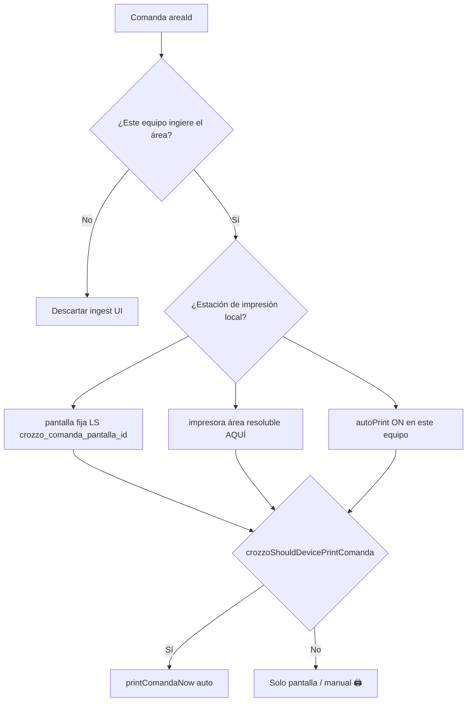
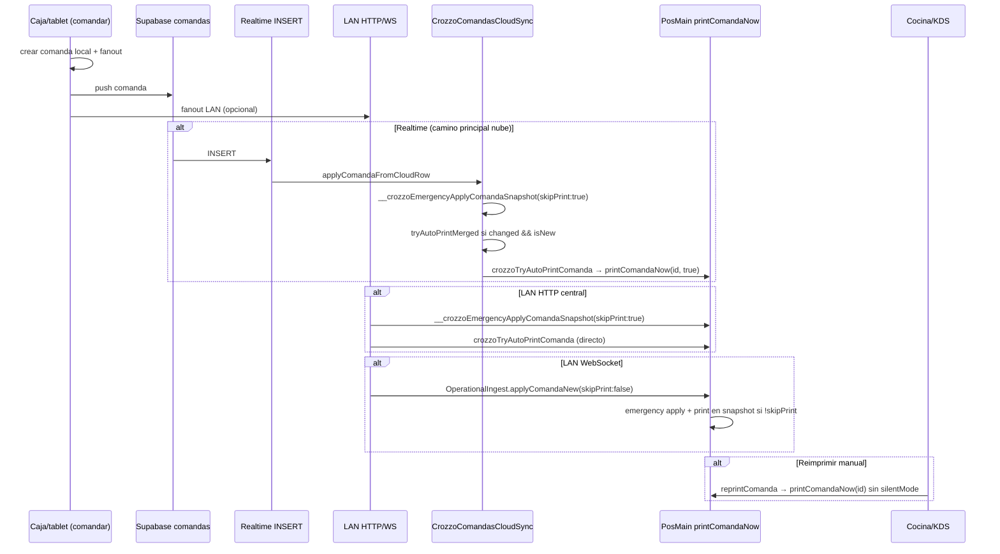

# Plan reparación — impresión automática de comandas (cocina/KDS)

> **Origen:** QA v1.0.229 — reimprimir manual 🖨️ OK; auto-print al ingestar desde nube **NO**.  
> **Progreso:** [`comanda-autoprint-repair-progress.json`](comanda-autoprint-repair-progress.json)  
> **Relacionado:** [LOG-RUNTIME-REPAIR-PLAN.md](LOG-RUNTIME-REPAIR-PLAN.md) · [CONNECTIONS.md](CONNECTIONS.md) · [SEQUENCES.md](SEQUENCES.md) · [SYNC-INVARIANTS.md](SYNC-INVARIANTS.md)

**Regla:** no ejecutar código hasta revisar este plan. Cada fase tiene criterio de hecho y archivos exactos.

---

## 1. Comportamiento esperado (definición de producto)

**No hay rol fijo “caja vs cocina”.** Cada restaurante elige la disposición; el sistema debe funcionar en **ambos** (y en N pantallas):

| Disposición típica | Qué hace el equipo |
|--------------------|-------------------|
| **Caja central** + pantalla aparte solo visual | Caja puede imprimir tickets si tiene térmica del área; la pantalla extra solo muestra |
| **PC dedicado en cocina** con impresora | Ese equipo es estación de impresión para su pantalla/área |
| **Varias pantallas** (Cocina, Barra, Postres…) | Cada dispositivo fija **una** pantalla (o hub); imprime solo las comandas de **su** área si tiene impresora |

### Regla única (la que pide el negocio)

> **En este dispositivo:** si la comanda es de un área que **corresponde** a la pantalla fijada aquí **y** este equipo tiene **impresora resoluble** para esa área **y** auto-imprimir está ON → imprimir al ingestar.  
> Si **no** hay impresora programada/resoluble en **este** equipo → **solo pantalla**, nunca auto-print (manual 🖨️ opcional).

| Condición | Resultado |
|-----------|-----------|
| Comanda llega por nube/LAN a un equipo que **muestra** esa área | Aparece en UI |
| Ese mismo equipo es **estación de impresión** para el área + auto ON | Ticket **automático** al ingestar (una vez) |
| Muestra el área pero **sin** impresora local resoluble | Solo pantalla |
| Auto-imprimir OFF en el equipo | No auto; **🖨️ manual** y “Imprimir pendientes” sí deben funcionar |
| Comanda ya impresa (`printed_at` / dedup) | No reimprime |

**Alcance:** Tauri PC/APK con térmica. Tablet mesero tomando pedidos no imprime salvo KDS fijo con pantalla asignada.

---

## 1b. Cómo identifica el sistema “este dispositivo imprime” (hoy)

No se usa el menú “cajero/cocina” como rol de impresión. Se combinan **tres capas por equipo**:



| Capa | Dónde | Qué responde |
|------|-------|--------------|
| **Pantalla fija** | `localStorage` `crozzo_comanda_pantalla_id` | “Este equipo es KDS de COCINA / BARRA / TODAS / sin fijar” |
| **Impresora del área en ESTE equipo** | Config área (`impresora`) + `crozzoResolvePrinterForJob` / `CrozzoPrintDeviceRegistry.collectLocalAreas` | El nombre está en config **global**, pero solo cuenta si la impresora **existe en el spooler local** |
| **Auto-imprimir** | Hoy: `config.comandas.autoPrint` **global** (gap → Fase 4: preferencia por equipo) | Toggle ON/OFF para auto al llegar |

**Funciones actuales (PosMain / PrintDeviceRegistry):**

- `crozzoDeviceShouldIngestComandaArea(areaId)` — ¿mostrar/recibir comanda?
- `crozzoShouldDevicePrintComanda(c)` — ¿auto-print en **este** equipo? (pantalla + impresora efectiva + autoPrint)
- `crozzoIsLocalPrintTargetForArea(areaId)` — delega a lo anterior; usado en ingest LAN/cloud

**Ejemplos**

| Equipo | Pantalla fija | Impresora COCINA resoluble local | Auto ON | Al llegar comanda COCINA |
|--------|---------------|----------------------------------|---------|--------------------------|
| PC caja | Sin fijar | Sí (térmica en mostrador) | Sí | Imprime en caja |
| PC caja | Sin fijar | No | Sí | Solo envía; cocina imprime |
| Monitor cocina | COCINA | No | Sí | Solo pantalla |
| PC cocina | COCINA | Sí | Sí | Imprime |
| PC cocina | COCINA | Sí | No | Pantalla + 🖨️ manual |

**Gap conocido:** al elegir impresora en el kiosk (`crozzoKioskOnPrinterChanged` → `setComandaPrinter`), el nombre se guarda en config **compartida** (nube). La **resolución física** sí es por equipo (`resolvesLocally`). En la práctica: dos PCs con la misma impresora lógica solo imprimen quien la tenga en spooler y cumpla pantalla + auto.

---

## 2. Síntomas reportados

1. Desde **caja → cocina**, **reimprimir manual** (🖨️ en nota) funciona.
2. Al **comandar**, la comanda **llega** a cocina pero **no imprime sola**.
3. El toggle **“Auto-imprimir al llegar pedido”** parece no surtir efecto en ese flujo (o el botón “Imprimir pendientes” no hace nada).
4. Impresora del área **sí** está programada en configuración.

---

## 3. Mapa del flujo actual (dónde decide imprimir)



### Archivos y funciones clave

| Archivo | Símbolo | Rol |
|---------|---------|-----|
| `app/core/CrozzoPosMain.js` | `crozzoShouldDevicePrintComanda` | Gate: autoPrint + impresora área + pantalla fija del equipo |
| `app/core/CrozzoPosMain.js` | `crozzoTryAutoPrintComanda` | Dedup + `printComandaNow(id, true)` |
| `app/core/CrozzoPosMain.js` | `printComandaNow` | **silentMode=true** exige `crozzoShouldDevicePrintComanda`; manual no |
| `app/core/CrozzoPosMain.js` | `toggleComandaAutoPrint` | Persiste `autoPrint` en **config global** (`config.comandas`) |
| `app/modules/CrozzoComandasCloudSync.js` | `applyComandaFromCloudRow` | Ingest nube; print solo si `changed && isNew\|itemsChanged` |
| `app/modules/CrozzoComandasCloudSync.js` | `tryAutoPrintMerged` | Llama auto-print post-merge |
| `app/infra/CrozzoPageCloudWatch.js` | `pullComandas` | `skipPrint: !(onKitchen \|\| printStation)` |
| `app/infra/CrozzoLanSyncBridge.js` | `tryApplyLanComanda` | LAN HTTP: snapshot skipPrint + `crozzoTryAutoPrintComanda` aparte |
| `app/infra/CrozzoLanWebSocketBridge.js` | handler comanda | LAN WS: `skipPrint: false` vía OperationalIngest |
| `app/modules/CrozzoPrintDeviceRegistry.js` | `isLocalPrintTargetForArea` | Capacidad impresión por área en red |

---

## 4. Diagnóstico — causas raíz probables (ordenadas)

### C1 — **CRÍTICO:** auto-print atado a `changed=true` en ingest nube

En `applyComandaFromCloudRow` (~L1147):

```javascript
if (!isOwnPush && !recentOwn && merged && !opts.skipPrint && !opts.silent && (isNew || itemsChanged)) {
  shouldPrint = tryAutoPrintMerged(merged, opts, ...);
}
```

Si la comanda **ya existe localmente** (LAN HTTP, pull previo, eco parcial, mismo equipo que comandó) → `changed=false` → **nunca** se llama `tryAutoPrintMerged`, aunque **nunca se haya impreso**.

**Evidencia:** LAN HTTP (`CrozzoLanSyncBridge.js` ~L505) aplica con `skipPrint:true` y confía en `crozzoTryAutoPrintComanda` aparte; si ese intento falla (gate pantalla/autoPrint), el Realtime posterior no reintenta.

---

### C2 — **ALTO:** `printComandaNow(silentMode=true)` mezcla auto-print con impresión silenciosa

~L11387 PosMain:

```javascript
if (silentMode && !crozzoShouldDevicePrintComanda(c)) return;
```

`crozzoShouldDevicePrintComanda` exige **`autoPrint` global ON**. Por tanto:

- Auto-print al llegar → usa silentMode → OK conceptualmente.
- **“Imprimir pendientes”** (`printAllPendingByArea`) también usa silentMode → **falla en silencio** si autoPrint OFF.
- **Reimprimir 🖨️** no usa silentMode → **siempre funciona** (coincide con el síntoma del usuario).

---

### C3 — **ALTO:** `isOwnPush` bloquea print en el mismo `device_id`

~L1101–1149 ComandasCloudSync: si `row.device_id === ctx.deviceUuid`, `shouldPrint=false`.

En **un solo PC** (caja + cocina, misma instancia Tauri): la comanda se crea local al comandar; el INSERT Realtime es “propio” → **no imprime en modo auto** aunque el usuario esté en pantalla cocina.

---

### C4 — **MEDIO:** `autoPrint` es config **global sincronizada**, no preferencia por equipo

`toggleComandaAutoPrint` guarda en `config.get('comandas')` (nube/local compartido). La **pantalla fija** sí es por equipo (`localStorage crozzo_comanda_pantalla_id`).

Riesgo: caja con autoPrint OFF pisa config; cocina con impresora no imprime aunque el toggle local parezca ON tras sync.

---

### C5 — **MEDIO:** ingest descartado por área

~L1069: `deviceShouldIngestComandaArea(pay.areaId)` → false si pantalla fija no coincide **y** `crozzoStationCanPrintArea` false.

Síntoma: comanda no aparece en cocina (distinto al reportado, pero hay que verificar pantalla fija vs área del producto).

---

### C6 — **BAJO:** ventanas que suprimen print

| Guard | Duración | Efecto |
|-------|----------|--------|
| `__crozzoComandaInBootPrintGrace` | 3 min post-boot | Realtime INSERT con `skipPrint:true` |
| Pull cloud antiguo | `updated_at` > 8 min | `skipPrint` forzado en pull |
| Dedup `__crozzoComandaWasPrinted*` | 90 s | Evita doble impresión (correcto) |

---

## 5. Plan de ejecución (orden estricto)

### Fase 0 — Reproducir con evidencia (sin cambiar código, ~20 min)

| Paso | Acción | Criterio de hecho |
|------|--------|-------------------|
| 0.1 | En cada equipo candidato a imprimir: anotar pantalla fija, impresora área, autoPrint | Tabla §1b |
| 0.2 | `localStorage.setItem('crozzo_debug_sync','1')` en estación que **debería** imprimir | Logs `[crozzo-rt]` |
| 0.3 | Diagnóstico comunicación / `CrozzoComunicacionDiag` | Fila impresión coherente con §1b |
| 0.4 | Comandar 1 ítem → anotar INSERT / print | Matriz abajo |

**Matriz de reproducción** (rellenar en tienda — no asumir solo “caja vs cocina”)

| Escenario | Pantalla fija | Impresora local resoluble | Auto ON | ¿Imprimió auto? |
|-----------|---------------|---------------------------|---------|-----------------|
| Caja envía, PC cocina imprime | COCINA en cocina | Sí en cocina | Sí | |
| Caja envía e imprime en mostrador | Sin fijar / TODAS | Sí en caja | Sí | |
| Caja envía, monitor cocina sin térmica | COCINA | No | Sí | (solo pantalla) |
| Mismo Tauri caja↔cocina | COCINA | Sí | Sí | |

**No tocar:** PosMain, ComandasCloudSync hasta tener fila de la matriz.

---

### Fase 1 — Reintento de print al ingest si nunca se imprimió (P0)

**Objetivo:** si la comanda está en cocina, no tiene `printed_at`/dedup, el equipo **debe** imprimir según `crozzoShouldDevicePrintComanda`, aunque `changed=false`.

| Paso | Acción | Archivo | Detalle técnico |
|------|--------|---------|-----------------|
| 1.1 | `npm run edit:scope -- app/modules/CrozzoComandasCloudSync.js applyComandaFromCloudRow` | — | Sello |
| 1.2 | Extraer helper `maybeAutoPrintOnIngest(merged, opts, ctx)` | `CrozzoComandasCloudSync.js` | Condiciones: `merged`, `!opts.skipPrint`, `!opts.silent`, `!ctx.isOwnPush` (solo para **notify**, no para print), `crozzoShouldDevicePrintComanda(merged)`, no dedup/printed |
| 1.3 | Llamar helper **después** del bloque `changed` | mismo | Si `!shouldPrint` del camino `isNew` **y** comanda mergeada existe sin print → intentar print |
| 1.4 | **No** imprimir si `itemsChanged` solo por corrección remota sin intención de reticket (mantener solo `isNew` o itemsChanged con regla documentada) | mismo | Evitar spam en updates de estado |

**Criterio de hecho:** caja comanda → cocina (equipo separado) imprime ≤3 s sin botón; consola `[crozzo-rt] INSERT aplicado: false` **puede** ser true pero igual imprime si nunca se imprimió.

**Tests:** `npm run test:sync-clinical` (92 checks).

---

### Fase 2 — Separar gate silent manual vs auto (P0)

**Objetivo:** reimprimir pendientes y auto-print no comparten el mismo bloqueo.

| Paso | Acción | Archivo | Detalle |
|------|--------|---------|---------|
| 2.1 | `npm run edit:scope -- app/core/CrozzoPosMain.js printComandaNow` | — | Sello |
| 2.2 | Cambiar firma interna: `printComandaNow(id, opts)` donde `opts = { silent, requireAutoPrint }` | PosMain | Default manual: `{ silent:false }`. Auto: `{ silent:true, requireAutoPrint:true }`. Bulk pendientes: `{ silent:true, requireAutoPrint:false }` |
| 2.3 | Gate silent: solo si `requireAutoPrint` → `crozzoShouldDevicePrintComanda`; si no → solo resolver impresora (`crozzoResolveComandaPrinter`) | PosMain | Manual/bulk ya no dependen de toggle auto |
| 2.4 | Actualizar llamadas: `crozzoTryAutoPrintComanda`, `printAllPendingByArea` | PosMain + grep callers | Mínimo diff |

**Criterio de hecho:** autoPrint OFF → llega comanda sin print; botón 🖨️ y “Imprimir pendientes” **sí** imprimen.

---

### Fase 3 — Decisión de print por estación, no por `device_id` origen (P1)

**Objetivo:** cumplir regla §1b en **caja con térmica**, **PC cocina dedicado** y **mismo Tauri** cambiando pantalla: imprime quien sea estación local para el `areaId`, no quien pusheó a nube.

| Paso | Acción | Archivo | Detalle |
|------|--------|---------|---------|
| 3.1 | En `applyComandaFromCloudRow`, usar `isOwnPush` / `recentOwn` **solo** para toasts, no para `shouldPrint` | ComandasCloudSync | Print = `crozzoShouldDevicePrintComanda(merged)` + dedup |
| 3.2 | Tras comandar en local (`dispatch` ~L22975): imprimir solo si **este** equipo ya es estación para el área; si no, no marcar como impreso | PosMain | Evita dedup que impide print en cocina real |
| 3.3 | Opcional: helper único `crozzoDeviceIsPrintStationForComanda(c)` que centralice pantalla + `crozzoResolveComandaPrinter` + autoPrint | PosMain | Reemplaza checks dispersos; alinea con `PrintDeviceRegistry` |

**Criterio de hecho:**

- Caja **sin** térmica cocina → comanda llega a PC cocina → imprime allí.
- Caja **con** térmica cocina + pantalla adecuada → puede imprimir en caja **o** en cocina según quién cumpla §1b (no duplicar).
- Monitor solo-display nunca auto-print aunque comparta config.

---

### Fase 4 — Preferencia autoPrint por equipo (P2, opcional)

**Objetivo:** toggle en cocina no depende del config global de caja.

| Paso | Acción | Archivo |
|------|--------|---------|
| 4.1 | LS `crozzo_device_auto_print` (null = heredar global) | PosMain |
| 4.2 | `crozzoShouldDevicePrintComanda` lee preferencia local primero | PosMain |
| 4.3 | `toggleComandaAutoPrint` escribe LS en estación; config global solo en admin/config-comandas | PosMain |
| 4.4 | Documentar en `DECISIONS.md` como D-008 | docs |

**Criterio de hecho:** caja autoPrint OFF no impide cocina autoPrint ON.

---

### Fase 5 — QA manual en tienda (P0)

| # | Caso | Esperado |
|---|------|----------|
| 1 | Caja → cocina PC distinto, auto ON, impresora COCINA | Ticket al llegar |
| 2 | Igual con auto OFF | Sin ticket; 🖨️ manual OK |
| 3 | “Imprimir pendientes” con auto OFF | Imprime cola |
| 4 | Sin impresora en área | No print; comanda visible |
| 5 | Boot reciente (<3 min) luego comanda | Tras fix Fase 1, evaluar si reducir grace solo para **display** no print |
| 6 | Reconexión nube (`skipPrint:true` en reconnect) | Comanda nueva post-reconnect imprime (Fase 1) |

---

## 6. Archivos que NO tocar en este plan

- `app/bundles/*`, `src/` (espejo)
- `CrozzoReservorio*`, Rust salvo bug de spooler confirmado
- CSS / layout cocina

---

## 7. Verificación automatizada

Tras Fases 1–3:

```bash
npm run sync
npm run test:sync-clinical
```

Opcional (si se añade test): assert en fixture que `applyComandaFromCloudRow` con `changed:false` + `printed_at:null` + mock `crozzoShouldDevicePrintComanda=true` invoca print.

---

## 8. Riesgos y mitigaciones

| Riesgo | Mitigación |
|--------|------------|
| Doble impresión caja+cocina | Mantener dedup `__crozzoComandaPrintDedup` + `printed_at` ack cloud |
| Print en UPDATE de items (corrección mesero) | Fase 1: solo `isNew` o flag explícito `isKitchenTicket` |
| Regresión sync | `test:sync-clinical` + no tocar fanout Z0 |

---

## 9. Resumen ejecutivo

La regla de negocio (**§1b**) ya está **parcialmente modelada** (`pantalla` por equipo + impresora resoluble local + autoPrint). Lo que falla es la **ejecución** al ingestar:

1. Camino **nube** solo auto-print si `changed=true` (comanda “nueva” en ese merge).
2. Modo **silent** exige `autoPrint` ON incluso para impresión manual batch — por eso 🖨️ manual funciona y auto/batch no.
3. `isOwnPush` y dedup post-dispatch pueden inhibir print en la estación correcta (caja sin térmica → cocina nunca recibe intento).

**Fix mínimo:** Fases **1 + 2** (≈1 PR). Fase **3** para alinear caja/cocina/monitor según §1b. Fase **4** si necesitan toggle auto distinto por equipo.
