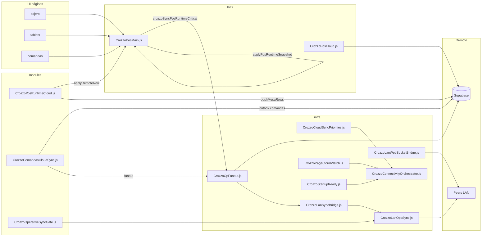
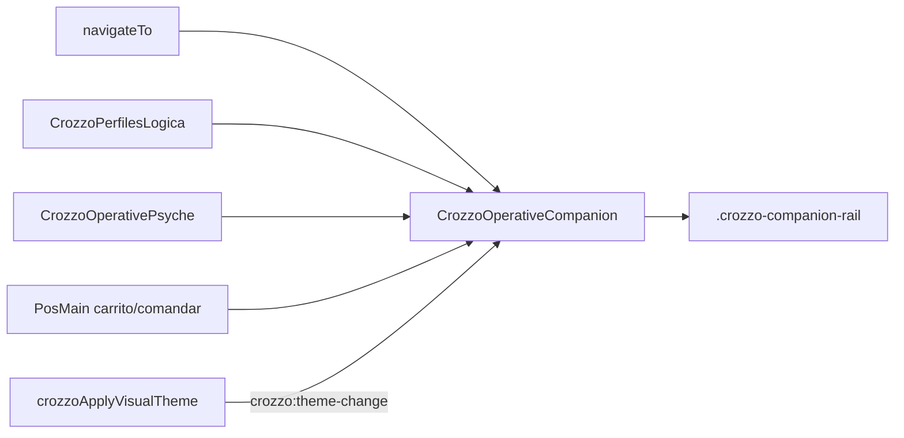

# Mapa de conexiones — módulos y dependencias

> Quién habla con quién. Para flujos temporales ver [SEQUENCES.md](SEQUENCES.md).

---

## Capa operativa Z0 (sync mesas/comandas)

---

## Tabla de acoplamiento (editar X → revisar Y)

| Si editas | Debes revisar | Por qué |
|-----------|---------------|---------|
| `CrozzoPosMain.js` (`crozzoReplaceCartsMaps`, `applyPosRuntimeSnapshot`) | `CrozzoPosRuntimeCloud.js` | Push/pull usa mismo payload |
| `CrozzoPosRuntimeCloud.js` (`applyRemoteRow`) | PosMain `crozzoHandleRemoteRuntimeUiSync` | UI post-sync |
| `CrozzoOpFanout.js` | `CrozzoLanOpsSync.js`, `CrozzoComandasCloudSync.js` | Fanout híbrido |
| `CrozzoLanOpsSync.js` | `crozzo_lan_sync_server.rs` (Rust) | API LAN nativa |
| `CrozzoCloudSyncPriorities.js` | `CrozzoPageCloudWatch.js`, `CrozzoCloudThrottle.js` | Z0/Z1 tier |
| `app/index.html` (orden scripts) | `BOOT-ORDER.md` (regenerar) | OpAck antes OpFanout |
| `CrozzoPosStyles.css` (touch/APK) | PosMain clases `body.classList` | Layout operativo |

---

## Globals puente (contrato entre archivos)

| Global | Definido en | Consumido por |
|--------|-------------|---------------|
| `crozzoSyncPosRuntimeCritical` | PosMain | PosMain, UI mutations |
| `applyPosRuntimeSnapshot` | PosMain | PosRuntimeCloud, LanOps |
| `crozzoHandleRemoteRuntimeUiSync` | PosMain | RuntimeCloud, LanOps, PageCloudWatch |
| `crozzoTierAllowsCloudSync` | CloudSyncPriorities / throttle | Casi toda infra |
| `crozzoOpFanoutRuntimeTouch` | OpFanout | PosMain sync critical |
| `getMultiDeviceConfig` | PosMain / config | RuntimeCloud, ComandasCloud |
| `crozzoHasCajaPermiso` | PosMain | UI permisos mesero/caja |
| `crozzoCompanionOnPage` | CrozzoOperativeCompanion | PosMain `navigateTo` |
| `crozzoOperativeCompanionGuardComandar` | CrozzoOperativeCompanion | PosMain `comandarDesdeCaja`, slot enter |
| `crozzoOperativeCan` / `crozzoOperativeProfileMeta` | CrozzoPerfilesLogica | Companion, permisos UI |

Lista completa exports PosMain: [POSMAIN-EXPORTS.md](POSMAIN-EXPORTS.md) (auto).

---

## UX operativa (acompañamiento por rol)

Norma visual: nuevos rails/paneles usan `--bg-card`, `--text-primary`, `--accent-rgb` y selectores `html[data-theme="bona-origen"]` / `html.crozzo-theme-dark` (no colores fijos oscuros).

---

## Supabase (tablas ↔ módulo)

| Tabla | Escritura principal | Lectura/realtime |
|-------|---------------------|------------------|
| `crozzo_mesa_runtime` | PosRuntimeCloud | PosRuntimeCloud, peers |
| `crozzo_sede_runtime` | PosRuntimeCloud (fallback) | idem |
| `comandas` | ComandasCloudSync | ComandasCloudSync, LanOps |
| `crozzo_sync_queue` | PosCloud (outbox) | PosCloud drain |

---

## NO conectar / NO mezclar

- **Reservorio** (`CrozzoReservorio*`) ↔ runtime Z0 (sin dependencia directa)
- **`src/` espejo** ↔ edición agente (solo `app/`)
