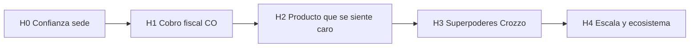

# Plan: Crozzo superior vs mercado Colombia

**Fecha:** 2026-07-17 · **Fuente:** [`AUDITORIA-CROZZO-POS-MERCADO-CO-2026-07.pdf`](../AUDITORIA-CROZZO-POS-MERCADO-CO-2026-07.pdf) · v1.0.230  
**Progreso machine-readable:** [`mejora-superior-progress.json`](mejora-superior-progress.json)  
**Doctrina de ejecución (Pentágono ops):** [`OPS-COMMAND-CENTER.md`](OPS-COMMAND-CENTER.md) — INTEL → COA → GATE → EXECUTE → VERIFY  
**Principio de la auditoría:** *Aburrido en el turno = profesional. Solo después pelear lo “wow”.*

### Hallazgos ops 2026-07-17 (endurecen el plan)

| Hallazgo | Impacto | Acción |
|----------|---------|--------|
| `dataicoStamp` es **stub simulado** (no API real) | H1.1 no se puede declarar “done” con UI actual | Sustituir por habilitador real + cola offline |
| Clinical verde; 0 critical **open**; KI-002 watch (git behind) | H0 técnico OK; H0 campo pendiente | Alinear git + QA sede + drills §9 |
| Nequi API QR/push + getStatus es vía real CO | H1.4 COA preferida sin datafono | Sandbox Nequi tras G4 campo |
| Industria: fallo = reconexión/duplicados, no happy path | Checklist ampliado | Drills Wi‑Fi/LAN/doble escritor |
| Preferencia dueño: costoso/profesional/BONA | H2 UX anclado | No banners; Cobrar CTA; silencio P0 |

---

## 0. Norte (qué significa “superior”)

No “más módulos”. Un dueño colombiano debe sentir:

| Momento | Sensación objetivo |
|---------|-------------------|
| Sábado 21:00, Wi‑Fi caído | La sede sigue cobrando, comandando e imprimiendo como si nada |
| Cobro con NIT | Un toque → cliente listo → tiquete POS / FE válido → listo |
| Pago Nequi / tarjeta | Medio digital conciliable, no “anotá la referencia a mano” |
| Encargado al cerrar | Cierre a ciegas + propinas + export contable sin Excel paralelo |
| Cadena / multi-tablet | Flota que se autosaná; el usuario no elige “modo LAN/nube” |
| Competidor en demo | Crozzo gana en **resiliencia + ops sala + food-cost**; empata o gana en DIAN/cobro |

**Posicionamiento:** *Sistema operativo de sede para Colombia inestable* — no otro SaaS cloud-only con modo offline de mentira.

**Meta de score (auditoría → 12 meses):**

| Dimensión | Hoy | Meta 90d | Meta 12m |
|-----------|-----|----------|----------|
| DIAN / FE | 3 | 4.5 | 5 |
| Ops restaurante | 4 | 4.5 | 5 |
| Offline CO | 5 | 5 | 5 (mantener) |
| Food cost | 4 | 4 | 5 |
| Pagos / delivery | 1 | 3.5 | 4.5 |
| Contabilidad | 2 | 3.5 | 4 |
| Multi-sede | 3 | 3.5 | 4.5 |
| UX madurez | 2 | 4 | 4.5 |
| Mantenibilidad | 1 | 2.5 | 4 |
| Time-to-value | 2 | 3.5 | 4.5 |
| **Nota global** | **3.0** | **~4.0** | **~4.5** |

---

## 1. Diagnóstico (honesto, anclado al código)

### Ya es ventaja real (no regalar)

- Offline-first + LAN WS/HTTP + gossip/BLE/Wi‑Fi Direct + flota identity/OTA.
- Z0 mesas/comandas/KDS/auto-print + roles/perfiles (restaurante/tienda/hotel F&B).
- Backoffice profundo: compras FE OCR, matriz costos, food-cost, inventarios.
- Lookup adquiriente DIAN+RUES (+ enrich sidecar).
- Plans en curso: sync repair (fase 5 = QA sede pendiente), ROLE-OPS ready_sede, COMM-CASCADE anti-solape hecho.

### Gaps que el mercado usa contra nosotros (auditoría §3)

| Gap | Severidad | Estado real hoy |
|-----|-----------|-----------------|
| Doc. equivalente + FE venta one-shot en Cobrar | P0 | Capaz (Dataico dock, CUFE, facturas) — **no** “un toque y listo” tipo Alegra |
| Estabilidad sede / sync critical | P0 | Código ROLE-OPS listo; **QA tienda P0 aún no cerrado en sede** |
| Pasarela / datafono / Nequi-PSE + conciliación | P0 | UI de medios (datafono/PSE/Nequi) existe; **falta integración real + conciliación** |
| Delivery + menú QR | P1 | Ausente / mínimo |
| Export contable plug-and-play | P1 | Débil vs Siigo |
| Onboarding &lt; 1 día | P1 | Time-to-value 2/5 |
| Partir PosMain (~51k LOC) | P1 | Deuda que frena todo lo demás |
| Cierre a ciegas + propinas en caja | P2 | Planilla 2026 parcial; no ops de caja completa |
| Hotel PMS real | P2 | Scaffold a propósito — no expandir aún |
| Periféricos certificados CO | P2 | Marketplace pendiente |

### Riesgo estructural

Cada feature nueva sobre el monolito sin modularizar **aumenta** la probabilidad de romper el turno. La superioridad sostenible exige **cerrar P0 + empezar a partir PosMain por dominio** en paralelo controlado.

---

## 2. Filosofía de ejecución

1. **Turno aburrido primero** — nada de delivery/analytics si el sábado noche falla.
2. **Un flujo oro por oleada** — criterio de hecho medible en sede (checklist), no “parece OK en dev”.
3. **Apalancar lo único de Crozzo** — mesh/flota/food-cost como arma; no copiar Siigo en contabilidad total.
4. **Capas “inimaginables” solo sobre cimientos** — DeviceMind / path health / auto-heal ya existen a medias; se vuelven producto cuando el dueño **no piensa en sync**.
5. **Diff mínimo, dominio a dominio** — `edit:scope`, `app/`, `test:sync-clinical` en Z0; no refactor Reservorio sin pedido.

Planes que este documento **orquesta** (no duplica):

| Plan existente | Rol aquí |
|----------------|----------|
| [SYNC-REPAIR-PLAN](SYNC-REPAIR-PLAN.md) + progress | Cerrar transporte Z0 |
| [QA-TIENDA-P0-CHECKLIST](QA-TIENDA-P0-CHECKLIST.md) | Puerta de oro sede |
| [ROLE-OPS-AUDIT-PLAN](ROLE-OPS-AUDIT-PLAN.md) | Acción×rol verde |
| [COMM-CASCADE-IMPROVE-PLAN](COMM-CASCADE-IMPROVE-PLAN.md) | Anti-solape / failover |
| [LOGICAS-PLAN-BASICO](LOGICAS-PLAN-BASICO.md) | Perfiles oficio |
| [COMANDA-AUTOPRINT-REPAIR-PLAN](COMANDA-AUTOPRINT-REPAIR-PLAN.md) | Cocina silenciosa |

---

## 3. Roadmap en 5 horizontes

### H0 — Confianza de sede (2–4 semanas) · *supervivencia*

**Objetivo:** Un turno multi-dispositivo sin drama. Nota: sin esto el resto es teatro.

| # | Entrega | Criterio de hecho | Anclas |
|---|---------|-------------------|--------|
| H0.1 | QA tienda P0 en verde **real** (caja+tablet+cocina) | Checklist completo firmado; misma OTA + `locationId` | `QA-TIENDA-P0-CHECKLIST.md`, `FLEET-DIAG-SEDE.md` |
| H0.2 | Cero critical sync abiertos en cocina/caja piloto | `issues:search` critical sync = 0 abiertos; clinical verde | `known-issues.json`, `test:sync-clinical` |
| H0.3 | ROLE-OPS oleadas A–F validadas en sede | Cada §8 del checklist marcado | `ROLE-OPS-*` |
| H0.4 | RLS Supabase por sede/rol (deuda Fase 0.3) | Schema audit + políticas mínimas | sync-repair 0.3 |
| H0.5 | Path health visible solo para encargado/admin | Chip discreto; cero toasts en cobro | `CrozzoTransportPathHealth`, COMM-CASCADE |

**No hacer en H0:** delivery, PMS hotel, rediseño total, CRDT.

---

### H1 — Cobro + fiscal Colombia one-shot (4–8 semanas) · *dejar de perder la demo*

**Objetivo:** En **Cobrar**, el flujo formal colombiano compite con Alegra/Siigo en percepción (no necesariamente en contabilidad completa).

| # | Entrega | Criterio de hecho | Notas de diseño |
|---|---------|-------------------|-----------------|
| H1.1 | **Documento equivalente POS** / tiquete electrónico en flujo Cobrar (Res. 000165) | Cobro → documento válido sin salir a Dataico embebido como “segundo producto” | Integrar proveedor (Dataico u otro habilitador) **dentro** del modal de cobro; CUFE/UUID persistido en factura local + nube |
| H1.2 | Reglas INC 8% / IVA 19% / tope UVT → forzar FE venta cuando aplique | UI avisa y no deja “tiquete” si la norma exige FE | Tabla de reglas versionada; no hardcode mágico en 20 sitios |
| H1.3 | Cliente FE: NIT → lookup → guardadito → cobro (&lt; 15 s happy path) | Checklist §3 + enrich no bloquea | Ya hay base CRM; pulir latencia y fallos soft |
| H1.4 | **Un** medio digital conciliable (elegir 1): datafono SDK **o** Nequi/PSE webhook | Pago registrado con ref externa + estado aprobado/rechazado/pendiente | Empezar por el medio que el piloto usa; UI ya tiene slots |
| H1.5 | Conciliación mínima del día | Lista “cobros digitales vs liquidación” en cierre | Suficiente para encargado; no ERP |

**Capacidad “wow” temprana (solo si H1.1–H1.4 estables):** *Cobro resiliente* — si la nube DIAN falla, cola local + reintento + estado “pendiente fiscal” visible; LAN sigue operando venta.

---

### H2 — Se siente producto caro (6–10 semanas, solapa fin H1) · *UX madurez 2→4*

**Objetivo:** Time-to-value y turno diario al nivel Gestro/Loggro en sensación.

| # | Entrega | Criterio de hecho |
|---|---------|-------------------|
| H2.1 | Onboarding sede guiado (&lt; 1 día → meta &lt; 2 h piloto) | Wizard: sede → roles → impresoras → menú mínimo → primer cobro |
| H2.2 | Caja “un trabajo por pantalla” | Cobrar dominante; CRM/companion nunca tapando CTA (KI CSS ya aprendidos) |
| H2.3 | Cierre de turno + propinas operativas en caja | Ciego opcional + arqueo + propinas sin solo planilla |
| H2.4 | Export contable v1 (CSV/Excel contador: PUC básico o plantilla Siigo-friendly) | Contador importa sin reescribir |
| H2.5 | **Modularizar PosMain por dominio (ola 1)** | Extraer 2–3 dominios sin cambiar comportamiento: cobro, facturas, mesas-runtime helpers → `app/core/pos/` (patrón ya iniciado con `CrozzoPosFacturasPage.js`) |
| H2.6 | Menú / pedido digital QR (1 canal propio) | Cliente pide desde mesa; entra como comanda Z0 |

**Deuda explícita:** cada extracción PosMain = clinical + checklist §4–5; un dominio por PR.

---

### H3 — Superpoderes solo-Crozzo (trimestre siguiente) · *lo inimaginable para el mercado CO*

Aquí se construye lo que Alegra/Siigo **no pueden copiar fácil** porque no tienen flota híbrida ni food-cost profundo.

| # | Capacidad | Por qué se siente superior | Dependencias |
|---|-----------|----------------------------|--------------|
| H3.1 | **Sede autosanable** | Caída de caja/router → heal LAN → mesh → hotspot sin que el mesero “configure nada” | DeviceMind, path health, D-010/D-012 |
| H3.2 | **Gemelo operativo del turno** | Encargado ve: mesas abiertas, comandas aging, impresoras, path scoreboard, riesgo de cola cocina | Runtime + comandas + diag flota |
| H3.3 | **Food-cost en vivo en el ticket** | Al comandar, margen/alerta de merma o costo plato (umbrales dueño) | Matriz MP / costos existentes |
| H3.4 | **Prefetch inteligente de menú/comanda** | Tablet en zona débil anticipa carta + slots calientes | UserSyncProfile + Z0 priorities |
| H3.5 | **1 aggregator delivery** (Rappi o DiDi) → comanda nativa | Un solo corcho cocina; no tablet aparte del rider | H0+H1 estables |
| H3.6 | **Analytics dueño “1 pantalla”** | Ticket medio, mix, horas pico, merma, propinas — sin BI externo | Cierre + facturas + costos |
| H3.7 | **Federación multi-sede v2** | Catálogo/roles/OTA por sede; métricas comparadas | Base federación ya scaffold |

**Regla H3:** ninguna de estas features si H0 no está verde en piloto.

---

### H4 — Escala y ecosistema (6–12 meses)

| # | Entrega |
|---|---------|
| H4.1 | PosMain partido: cobro / mesas / permisos / sync-UI en módulos; monolito &lt; ~25k LOC o fachada delgada |
| H4.2 | Marketplace periféricos CO (impresoras, datafonos certificados) con perfiles de driver |
| H4.3 | Segundo medio de pago + tips en datafono |
| H4.4 | Contabilidad más profunda **o** conector nativo Siigo/Alegra (export bidireccional ligero) — decidir según clientes piloto |
| H4.5 | Hotel PMS: solo si hay cliente que lo pague; hoy F&B scaffold es correcto (no inventar PMS) |
| H4.6 | Soporte/ops: “modo rescate sede” documentado (ya hay scripts QA; empaquetar para partner) |

---

## 4. Capas de producto (cómo se siente “otro nivel”)

### Capa A — Invisible (confianza)
Sync, dedup, failover, OTA, permisos UI-only. El usuario no la nombra.

### Capa B — Turno (velocidad)
Cobrar, comandar, LISTO, precuenta, CRM NIT, impresión. Cada acción &lt; 2 toques cuando sea posible.

### Capa C — Formalización CO (permiso de vender)
Doc. equivalente, FE, INC/IVA, medios digitales, cierre/export.

### Capa D — Inteligencia de sede (solo Crozzo)
Gemelo del turno, food-cost en vivo, flota autosanable, analytics dueño.

### Capa E — Ecosistema
Delivery, periféricos, multi-sede, conectores contables.

**Orden de inversión de energía:** A→B→C→D→E. Saltarse A/B/C es como vender un auto sin frenos con HUD holográfico.

---

## 5. Backlog priorizado (P0 / P1 / P2) — vista dueño

### P0 (hacer ya)

1. Cerrar QA sede + critical sync (H0).
2. FE / doc. equivalente one-shot en Cobrar (H1.1–H1.3).
3. Un medio digital conciliable (H1.4–H1.5).

### P1 (siguiente)

1. Onboarding + cierre/propinas + export contable (H2.1–H2.4).
2. Modularización PosMain ola 1 (H2.5).
3. Menú QR propio (H2.6).
4. Delivery ×1 (H3.5) cuando P0 esté muerto.

### P2 (diferenciación)

1. Gemelo operativo + sede autosanable producto (H3.1–H3.2).
2. Food-cost en vivo (H3.3).
3. Analytics dueño + federación (H3.6–H3.7).
4. Periféricos certificados + PosMain ola 2–3 (H4).

---

## 6. Métricas de “superior” (no vanidad)

| Métrica | Meta piloto |
|---------|-------------|
| Minutos desde unbox → primer cobro FE/tiquete | &lt; 120 |
| Incidentes sync que paran cobro / semana | 0 |
| % cobros con medio digital conciliado | ≥ 40% del no-efectivo |
| Tiempo mesa→comanda visible cocina (P95 LAN) | &lt; 2 s |
| Tiempo recuperación Wi‑Fi caído 30 s | datos OK sin re-login |
| Regresiones clinical en PR Z0 | 0 |
| Contador: tiempo a cerrar mes con export | &lt; 30 min vs proceso |

---

## 7. Equipo / forma de trabajar (Crozzo)

| Situación | Modo |
|-----------|------|
| Fix 1 símbolo / CSS / KI | Agent directo |
| H0 sync / H1 cobro fiscal / ≥2 críticos | Plan → Agent |
| Extracción PosMain | 1 dominio/PR + clinical + checklist parcial |
| Review PR grande H1/H2 | Bugbot si se pide |
| Hotel PMS / CRDT / segundo roster | Fuera de scope hasta pedido explícito |

---

## 8. Secuencia recomendada de sprints (90 días)

| Sprint | Foco | Salida |
|--------|------|--------|
| S0 (esta semana) | Campo: QA-TIENDA-P0 + FLEET-DIAG en piloto | Lista fallos reales priorizados |
| S1–S2 | Matar fallos H0 + critical KI | Checklist verde |
| S3–S5 | H1.1–H1.3 fiscal one-shot | Demo “abre y factura” |
| S5–S7 | H1.4–H1.5 pagos | Medio digital vivo |
| S6–S8 | H2.1–H2.3 + inicio H2.5 | Onboarding + cierre; primer slice PosMain |
| S9–S12 | H2.4–H2.6 + diseño H3.1–H3.2 | Export + QR; blueprint gemelo sede |

---

## 9. Qué NO hacer (anti-plan)

- Sumar features de menú lateral “porque el competidor las tiene” sin H0.
- Reescribir todo a React/Vue en este horizonte.
- Inventar PMS hotel completo.
- Apagar LAN en Z0 “porque la nube va bien”.
- Conciliación bancaria tipo ERP antes de un medio digital simple.
- Editar `src/` o Reservorio en los mismos PRs que cobro/sync.

---

## 10. Decisión pendiente del dueño (elige 1 para arrancar implementación)

1. **Campo primero:** ejecutar QA sede esta semana y abrir bugs H0 con evidencia.  
2. **Fiscal primero:** diseñar H1.1 (proveedor + UX Cobrar) en paralelo al QA.  
3. **Pagos primero:** elegir datafono vs Nequi/PSE según hardware del piloto.

**Recomendación:** (1) + diseño en papel de (2) la misma semana. Sin sede verde, el one-shot fiscal se construye sobre arena.

---

## 11. Conclusión

La auditoría ya dijo la verdad: Crozzo es un **SO de sede** ambicioso, no un juguete — y aún no es el reemplazo aburrido-y-confiable del SaaS pulido.  
Este plan convierte esa exigencia en capas: **confianza → cobro formal CO → producto caro → superpoderes de flota/food-cost → ecosistema**.  
Lo “inimaginable” no es un chatbot en caja: es que en Colombia real (luz, Wi‑Fi, DIAN, Nequi, sábado) **el sistema se adelante al caos** y el dueño sienta que el resto del mercado es frágil.
