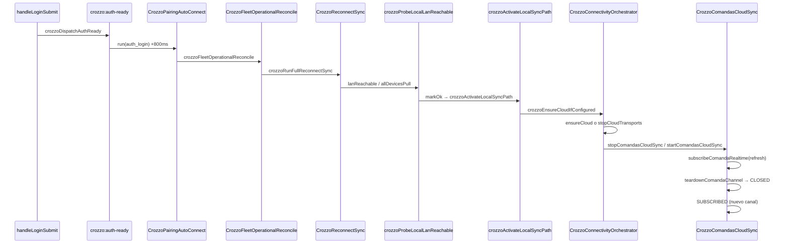

# Plan reparación — logs runtime Tauri (post-login, sin tablet)

> **Origen:** sesión Tauri v1.0.229, caja sola, PowerShell.  
> **Progreso:** [`log-runtime-repair-progress.json`](log-runtime-repair-progress.json)  
> **Relacionado:** [SYNC-REPAIR-PLAN.md](SYNC-REPAIR-PLAN.md) · [CONNECTIONS.md](CONNECTIONS.md) · [SEQUENCES.md](SEQUENCES.md)

**Regla:** no ejecutar hasta revisar este plan. Cada paso tiene criterio de hecho y archivos exactos.

---

## 1. Diagnóstico de logs (qué es error vs ruido)

| Log / síntoma | Severidad | ¿Es bug? | Interpretación |
|---------------|-----------|----------|----------------|
| `buildFullTicketData is not defined` en `printComandaNow` | **CRÍTICO** | **Sí** | Refactor incompleto: llama funciones que **no existen** en el repo (`buildFullTicketData`, `generateTicketHtml`). Rompe reimprimir/comandar impresión. |
| `[crozzo-rt] SUBSCRIBED` → `CLOSED (refresh)` | **MEDIO** | Parcial | Resuscripción intencional al refrescar canal; el **stack** muestra que también pasa por `stopCloudTransports` → `stopComandasCloudSync` en cadena post-login. |
| `[crozzo-rt] INSERT aplicado: false` | **INFO** | Normal* | Tras comandar, Realtime devuelve el INSERT propio; dedup (`comandaTidRecent`, `own_echo`, mismo `device_id`) rechaza reaplicar. *Esperado si la comanda ya está local. |
| `[runtime-cloud] pushMesaRows OK · filas=1 []` alternando con `filas=2 [mesa:M1]` | **MEDIO** | Posible | Push repetido: a veces solo fila `meta`, a veces mesas. Puede ser thrashing de firma/slot (ver Fase mesaRows + debounce). |
| `[Violation] setTimeout handler took 106ms` | **BAJO** | No | PosMain pesado al render; optimización futura. |
| `[DOM] Password field is not contained in a form` | **BAJO** | No | Aviso Chrome del login; cosmético. |

---

## 2. Cadena de conexiones (mapa → logs)

Secuencia reconstruida del stack trace del usuario:



**Archivos clave (CONNECTIONS Z0):**

| Módulo | Rol en este incidente |
|--------|------------------------|
| `CrozzoPairingAutoConnect.js` | Dispara reconcile + LAN tras login |
| `CrozzoFleetOperationalReconcile.js` | `runFullReconnectSync` + `activateLocalSyncPath` |
| `CrozzoReconnectSync.js` | Pull runtime + `startComandasCloudSync` |
| `CrozzoPosMain.js` | `crozzoActivateLocalSyncPath`, `crozzoProbeLocalLanReachable`, **`printComandaNow` roto** |
| `CrozzoConnectivityOrchestrator.js` | `ensureCloud` / `stopCloudTransports` |
| `CrozzoComandasCloudSync.js` | Realtime SUBSCRIBED/CLOSED, INSERT dedup |
| `CrozzoPosRuntimeCloud.js` | `pushMesaRows` logs repetidos |
| `CrozzoPrintService.js` | **`crozzoPrintComanda`** — camino correcto de impresión |

**Conflicto detectado:** `CrozzoPosMain.js` redefine `window.crozzoDeferLocalSync` **después** de `CrozzoConnectivityStandby.js` (orden en `index.html` L1193–1194), pisando la lógica de outbox + `crozzoCloudDataPathRecent` del plan sync anterior.

---

## 3. Plan de ejecución (orden estricto)

### Fase A — Impresión comandas (P0, 1 PR, ~15 min)

**Síntoma:** `Uncaught ReferenceError: buildFullTicketData is not defined`  
**Causa:** Bloque muerto en `printComandaNow` (~L11389–11398) que nunca debería ejecutarse; el flujo real ya está abajo con `crozzoPrintComanda`.

| Paso | Acción | Archivo | Criterio de hecho |
|------|--------|---------|-------------------|
| A.1 | `npm run edit:scope -- app/core/CrozzoPosMain.js printComandaNow` | — | Sello OK |
| A.2 | Eliminar bloque roto (`buildFullTicketData` / `generateTicketHtml` / `printRawTicketHtml`) | `app/core/CrozzoPosMain.js` | Grep repo: 0 refs a `buildFullTicketData` |
| A.3 | Dejar solo flujo `crozzoResolveComandaPrinter` → `crozzoPrintComanda` | mismo | Botón 🖨️ reimprimir no lanza excepción |
| A.4 | `npm run sync` | — | `src/` espejo OK |
| A.5 | Prueba manual Tauri | cocina/comandas | Reimprimir comanda → toast impresión o aviso “sin impresora”, **sin crash** |

**NO tocar:** `CrozzoPrintService.js` salvo que A.3 falle (usar API existente).

---

### Fase B — Realtime SUBSCRIBED→CLOSED post-login (P1, 1 PR)

**Síntoma:** Warning `realtime CLOSED (refresh)` justo después de login  
**Causa probable:** Doble arranque/parada: reconnect + `subscribeComandaRealtime('refresh')` hace `teardownComandaChannel` mientras orchestrator también evalúa `stopCloudTransports`.

| Paso | Acción | Archivo | Criterio de hecho |
|------|--------|---------|-------------------|
| B.1 | Leer `ensureCloud` cuando `!crozzoCloudBackgroundSyncAllowed()` (hub/login vs Z0) | `CrozzoConnectivityOrchestrator.js` | Documentar si stop en login es intencional |
| B.2 | En `ensureCloud`, si `stopCloudTransports` por `!rtOk`, usar **`stopCloudTransportsDeferred`** en modo híbrido | `CrozzoConnectivityOrchestrator.js` | Tras login en cajero, ≤1 CLOSED warn en 10s |
| B.3 | `startComandasCloudSync`: si canal SUBSCRIBED y filtro igual, **no** llamar `subscribeComandaRealtime('refresh')` | `CrozzoComandasCloudSync.js` | Evitar teardown innecesario |
| B.4 | `PairingAutoConnect`: tras login, pasar flag `skipFleetReconnect` si ya hubo `startComandasCloudSync` reciente | `CrozzoPairingAutoConnect.js` + `CrozzoFleetOperationalReconcile.js` | Menos tormenta post-auth |
| B.5 | Bajar warning CLOSED a `rtLog` cuando `reason === 'refresh'` y resuscripción inmediata | `CrozzoComandasCloudSync.js` | Consola limpia salvo `crozzo_debug_sync=1` |
| B.6 | `npm run test:sync-clinical` | — | 92/92 OK |

**Invariante:** [SYNC-INVARIANTS.md](SYNC-INVARIANTS.md) #8 — anti-flap re-suscripción.

---

### Fase C — Unificar `crozzoDeferLocalSync` (P1, mismo PR o PR separado)

**Síntoma:** Regresión silenciosa del plan sync (LAN standby / calidad nube)  
**Causa:** PosMain sobrescribe global al cargar después de ConnectivityStandby.

| Paso | Acción | Archivo | Criterio de hecho |
|------|--------|---------|-------------------|
| C.1 | Eliminar o reducir `window.crozzoDeferLocalSync` en PosMain a delegación | `CrozzoPosMain.js` ~L35447 | Una sola implementación en `CrozzoConnectivityStandby.js` |
| C.2 | Si PosMain necesita regla híbrida, moverla **dentro** de ConnectivityStandby | `CrozzoConnectivityStandby.js` | `crozzoCloudDataPathRecent` + outbox activos |
| C.3 | Verificar orden scripts: Standby **después** PosMain (mantener) | `app/index.html` | Standby gana siempre |
| C.4 | Entrada en `DECISIONS.md`: “defer local = ConnectivityStandby único” | docs | — |

---

### Fase D — pushMesaRows thrashing (P2, 1 PR)

**Síntoma:** Logs repetidos `pushMesaRows OK · filas=1 []` / `filas=2 [mesa:M1]`  
**Causa probable:** Alternancia meta-only vs mesas tras `mesaRowsFromSnap` (slots comanda vacíos) + saves frecuentes.

| Paso | Acción | Archivo | Criterio de hecho |
|------|--------|---------|-------------------|
| D.1 | `edit:scope` → `pushMesaRows`, `mesaRowsFromSnap`, `schedulePosRuntimeSave` | PosMain + PosRuntimeCloud | — |
| D.2 | Log `pushMesaRows OK` solo con `localStorage crozzo_debug_sync=1` | `CrozzoPosRuntimeCloud.js` | Consola normal sin debug |
| D.3 | Revisar si filas “comanda activa, carrito vacío” oscilan firma `__mesaSlotSig` | `CrozzoPosRuntimeCloud.js` | Estabilidad: ≤1 push/s por mesa en idle |
| D.4 | Confirmar `despacharComanda` no llama `schedulePosRuntimeSave` en cocina (fix previo) | `CrozzoPosMain.js` | LISTO no dispara push vacío desde KDS |

---

### Fase E — Ruido INSERT aplicado:false (P3, opcional)

| Paso | Acción | Criterio |
|------|--------|----------|
| E.1 | En handler INSERT Realtime, log `aplicado:false` solo si motivo ≠ own_echo / duplicate_tid | Consola más clara |
| E.2 | Documentar en KNOWN-ISSUES como KI-020 “INSERT echo normal” | `known-issues.json` |

---

### Fase F — Verificación en tienda (después de A–D)

| # | Escenario | Esperado |
|---|-----------|----------|
| 1 | Login caja → consola | ≤1 par SUBSCRIBED/CLOSED; sin errores rojos |
| 2 | Comandar mesa | INSERT aplicado false OK (echo); comanda visible |
| 3 | Reimprimir 🖨️ | Sin ReferenceError |
| 4 | Conectar tablet después | Comandas/runtime siguen visibles |
| 5 | `getMultiDeviceConfig()` | role A, LAN :3000 OK |

---

## 4. Prioridad de ejecución recomendada

```
A (impresión)  →  inmediato — bloquea operación cocina
B + C (realtime + defer)  →  segundo — estabilidad post-login
D (push thrashing)  →  tercero — rendimiento/consola
E (ruido)  →  cuando haya tiempo
F (QA)  →  siempre al cierre
```

**Estimación:** Fase A sola desbloquea impresión; B+C mejoran arranque; D limpia consola.

---

## 5. Comandos pre-ejecución (agente)

```bash
npm run issues:search -- "realtime CLOSED"
npm run issues:search -- "printComanda"
npm run edit:scope -- app/core/CrozzoPosMain.js printComandaNow
npm run map:refresh   # opcional, tras cambios exports
npm run sync
npm run test:sync-clinical
```

---

## 6. Registro

| Fecha | Evento |
|-------|--------|
| 2026-07-07 | Plan creado desde logs Tauri v1.0.229 (sin tablet) |
| 2026-07-08 | Fases A–E ejecutadas; test:sync-clinical 92/92; F pendiente QA manual |
